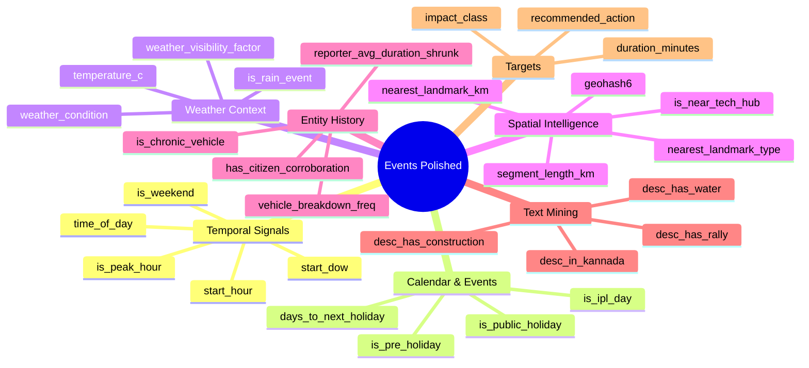

# 📊 Knowledge Transfer (KT) Summary: ECF-MS Polished Dataset

This document provides a technical overview of `events_polished.csv`, prepared for team walk-throughs and ML engineering alignment.

---

## 1. Executive Summary

| Metric | Detail | Description |
|---|---|---|
| **Total Record Count** | 8,173 rows | Full event log history |
| **Feature Dimensionality** | 104 columns | Enriched spatial, temporal, text, and entity features |
| **Temporal Span** | Nov 10, 2023 – Apr 8, 2024 | ~5 months of continuous metropolitan event coverage |
| **Baseline Target** | `duration_minutes` | Regression target (observed for 2,725 closed events) |
| **Operational Target** | `impact_class` | Derived multi-class classification target |

---

## 2. Feature Taxonomy (104 Columns)

The polished dataset categorizes its 104 features into 7 logical feature blocks:



---

## 3. Core Target Distributions

### A. Impact Class Distribution (`impact_class`)
Used as the classification target for the **Layer 2 Severity Model**. Note the heavy skew towards `Critical` and `Low` events:

```
Critical :  5,503 (67.3%)  <-- Primary operational bottleneck
Low      :  1,599 (19.6%)  <-- Routine/minor events
Medium   :    793 (9.7%)   <-- Moderate congestion
High     :    278 (3.4%)   <-- Severe localized backup
```

### B. Event Duration Statistics (`duration_minutes`)
*   **Total Closed Events**: 2,725 records (66.6% missing represents active/unresolved events or missing timestamps)
*   **Mean Duration**: 122.5 minutes
*   **Median (50%)**: 49.3 minutes
*   **75th Percentile**: 96.5 minutes
*   **Maximum Duration**: 1,439.8 minutes (capped at 24 hours)

### C. Recommended Action Distribution (`recommended_action`)
Defines the final recommendation mapping rules for the **Layer 4 Action Engine**:

```
NO_ACTION              : 6,508 (79.6%)
MONITOR                :   719 (8.8%)
PARTIAL_CLOSURE_DIVERT :   642 (7.9%)
OFFICER_DEPLOY         :   245 (3.0%)
FULL_DIVERSION         :    55 (0.7%)
HAZMAT_PROTOCOL        :     4 (0.05%)
```

---

## 4. Data Quality & Missingness Audit

A key topic for KT is how we handled sparse and missing columns in the raw dataset:

*   **Vehicle Types (`veh_type` is 40.2% null)**: Imputed via regex text-mining on `description` to create `veh_type_clean` (extracting terms like "BMTC", "truck", "auto", "car").
*   **Corridors & Zones (~58% null)**: Imputed using reverse-geocoding modes: mapped missing corridors based on active zone modes, and missing zones based on corridor modes.
*   **Junctions (~69% null)**: Imputed based on police station modes.
*   **High-Sparse Entity Data**:
    *   `cargo_material` (96.6% null) & `age_of_truck` (96.6% null): Kept as-is for HAZMAT protocol triggers.
    *   `citizen_accident_id` (98.4% null): Mapped to a binary flag `has_citizen_corroboration` to represent crowd-sourced validation.

---

## 5. Key ML Takeaways for the Team

1.  **Chronological Ordering**: The dataset is sorted by `start_datetime`. Do **not** use random cross-validation. Use time-based split methods.
2.  **Target Leakage Guard**: Do not let the model train on `closed_datetime`, `resolved_datetime`, or `recommended_action`.
3.  **Space-Time Sparsity**: When grouping data for the Layer 3 Risk model by `(zone, corridor, hour_block, week)`, ~92% of the space-time grid will be zero-event rows. Ensure class weights are balanced during LightGBM fitting and use EWMA for lag calculation.
