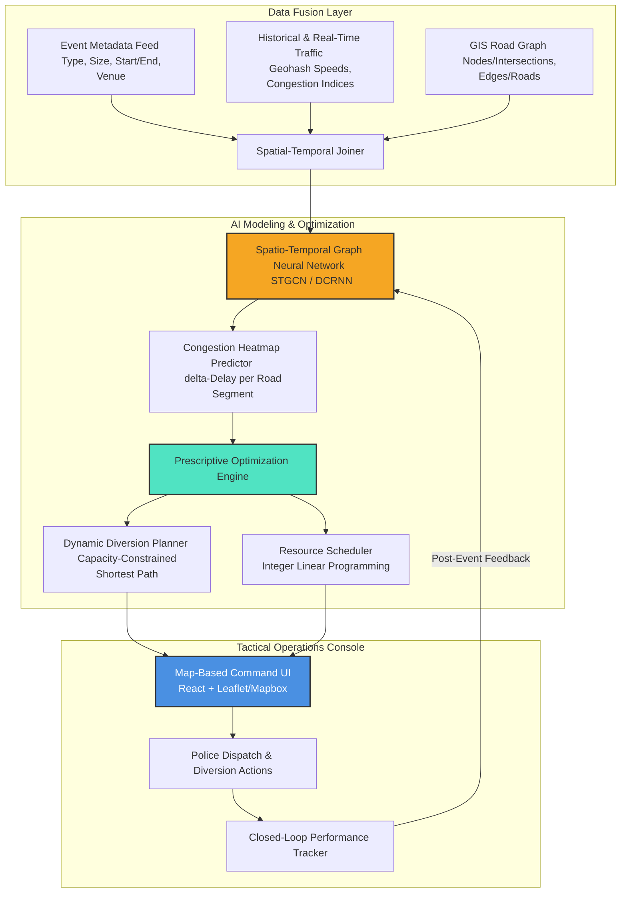

# 🚦 Concept Note & Prototype Proposal: Event-Driven Congestion forecasting & Mitigation System (ECF-MS)

This proposal details the conceptual design, algorithmic framework, and system architecture for an AI-driven traffic intelligence platform. The platform proactively forecasts congestion induced by planned and unplanned events, recommending optimal traffic police deployment, physical barricading points, and vehicle diversion paths.

---

## 1. Executive Summary

In rapidly developing cities like Bengaluru, both planned events (cricket matches, political rallies, festivals) and unplanned incidents (protests, waterlogging, large-scale construction) cause localized traffic breakdowns that quickly cascade into multi-kilometer gridlocks. Currently, traffic police respond reactively, relying on personal experience to place barricades and deploy officers.

**ECF-MS (Event-Driven Congestion Forecasting & Mitigation System)** bridges this gap by merging historical spatio-temporal traffic data with event calendars and real-time feeds. The system operates in two core phases:
1. **Predictive Phase**: Estimates the spatial-temporal propagation of traffic delay across the city's road network graph during the event window.
2. **Prescriptive Phase**: Formulates resource allocation and vehicle routing as a network optimization problem to recommend specific diversion plans, barricade placements, and personnel staffing.

---

## 2. System Architecture & Data Flow

The ECF-MS architecture consists of three layers: **Data Fusion, AI Modeling & Optimization, and the Tactical Operator Dashboard**.

---

## 3. Methodology & Deep Technical Modeling

### 3.1. Spatial Representation: Road Network as a Graph
Instead of treating coordinates or geohashes in isolation, the road network is modeled as a directed graph $G = (V, E, W)$, where:
*   $V$ is the set of vertices (intersections, intersections with signals, major roundabouts).
*   $E$ is the set of directed edges (road segments connecting intersections).
*   $W$ represents the edge weights, dynamically defined by physical distance, number of lanes, speed limit, and historical travel time.

### 3.2. Spatio-Temporal Prediction Engine
To model how congestion propagates, the system uses a **Spatio-Temporal Graph Convolutional Network (STGCN)**.
*   **Spatial Convolution**: Captures topological dependencies (e.g., if road segment $e_i$ is clogged, it will back up traffic on upstream segment $e_j$).
*   **Temporal Convolution**: Captures chronological trends (e.g., time-of-day rush hours, weekday vs. weekend patterns).

The model predicts the traffic state tensor $Y_{t+\Delta t}$ (representing average speed and volume on all edges) given historical states $X_{t-k, \dots, t}$ and event features $F_{event}$:

$$Y_{t+\Delta t} = \text{STGCN}(X_{t-k, \dots, t}, G, F_{event})$$

#### Event Feature Vector ($F_{event}$)
Each event is encoded into a high-dimensional vector:
*   **Event Category**: Categorical encoding (e.g., Sports, Rally, Protest, Construction).
*   **Intensity Rank**: Estimated scale based on venue capacity or expected attendance.
*   **Temporal Profile**: Time relative to event start (e.g., pre-event arrival rush, post-event exit surge).
*   **Epicenter Node**: The closest vertex in $G$ corresponding to the event location.

---

## 4. Prescriptive Optimization: The Mitigation Layer

Having a forecast is only half the battle. ECF-MS translates the predictions into actionable tactical recommendations for traffic controllers.

### 4.1. Manpower Allocation (Integer Linear Programming)
Let $x_v$ be a binary decision variable indicating whether a traffic officer is deployed to intersection node $v \in V$.
Let $C_v(t)$ be the predicted congestion cost (in terms of traffic delay or queuing length) at node $v$ during the event window.
Let $P_v$ be the effectiveness rating of an officer at node $v$ (e.g., an officer at a signalized junction is more effective than at a minor lane).

We maximize the total congestion mitigated, subject to budget and staffing constraints:

$$\max \sum_{v \in V} C_v(t) \cdot P_v \cdot x_v$$

$$\text{Subject to: } \sum_{v \in V} x_v \le N_{avail}$$

Where $N_{avail}$ is the total number of traffic police personnel available for the shift.

### 4.2. Capacity-Constrained Diversion Planner
When diverting traffic away from a blocked or congested area, a naive routing system (like standard Dijkstra's) will direct all vehicles to the next shortest route, quickly clogging that route.

ECF-MS utilizes **Dynamic Traffic Assignment (DTA)** under capacity constraints. The system identifies alternative routes $R = \{r_1, r_2, \dots, r_m\}$ between major entry and exit points, and distributes flows $f_r$ to satisfy Wardrop's User Equilibrium, ensuring that:
1. No diversion route exceeds its road carrying capacity $C_e$.
2. The overall travel delay across the regional subgraph is minimized.
3. Physical barricading recommendations are placed at entry vertices to block incoming non-essential traffic and direct them toward the diversion routes.

---

## 5. Prototype Implementation Plan & Tech Stack

| Component | Technology | Rationale |
| :--- | :--- | :--- |
| **Backend & APIs** | FastAPI (Python) | High performance, async, automated OpenAPI docs |
| **Database** | PostgreSQL + PostGIS | Spatial queries on coordinates, geohashes, road shapes |
| **ML Engine** | PyTorch Geometric + LightGBM | GNN for graph modeling; LightGBM for tabular features |
| **Optimization** | PuLP / SciPy | Fast ILP for real-time manpower distribution |
| **Map Rendering** | Leaflet.js / Mapbox GL JS | Interactive heatmaps and route overlays |
| **Front-End** | React.js (Vite) | Component-based, responsive live metrics |

---

## 6. Verification and Metrics Plan

### 6.1. Predictive Accuracy
*   **MAE / MAPE** on predicted clearance duration vs. actual `duration_minutes`
*   **F1-Score for Bottleneck Detection**: Identify road segments with >30% speed drop

### 6.2. Prescriptive Value
*   **Throughput Improvement Index**: Simulated delay reduction under recommended diversion vs. unmanaged
*   **Manpower Efficiency Ratio**: % high-congestion nodes covered under ILP vs. patrol baseline

### 6.3. Computational Performance
*   **Inference Latency**: < 5 seconds for 1,000 nodes
*   **Optimization Run Time**: < 2 seconds for manpower assignment

---

## 7. Strategic Impact for the City

> [!NOTE]
> ECF-MS moves traffic management from **crisis response to planning-led coordination**.

*   **Public Safety**: Directing traffic away from narrow roads during protests reduces crowd-vehicle conflicts.
*   **Economic Savings**: Minimizing event bottlenecks keeps delivery supply chains moving through city centers.
*   **Environmental Benefit**: Preventing idling queues reduces localized CO2 and particulate emissions during event peaks.
