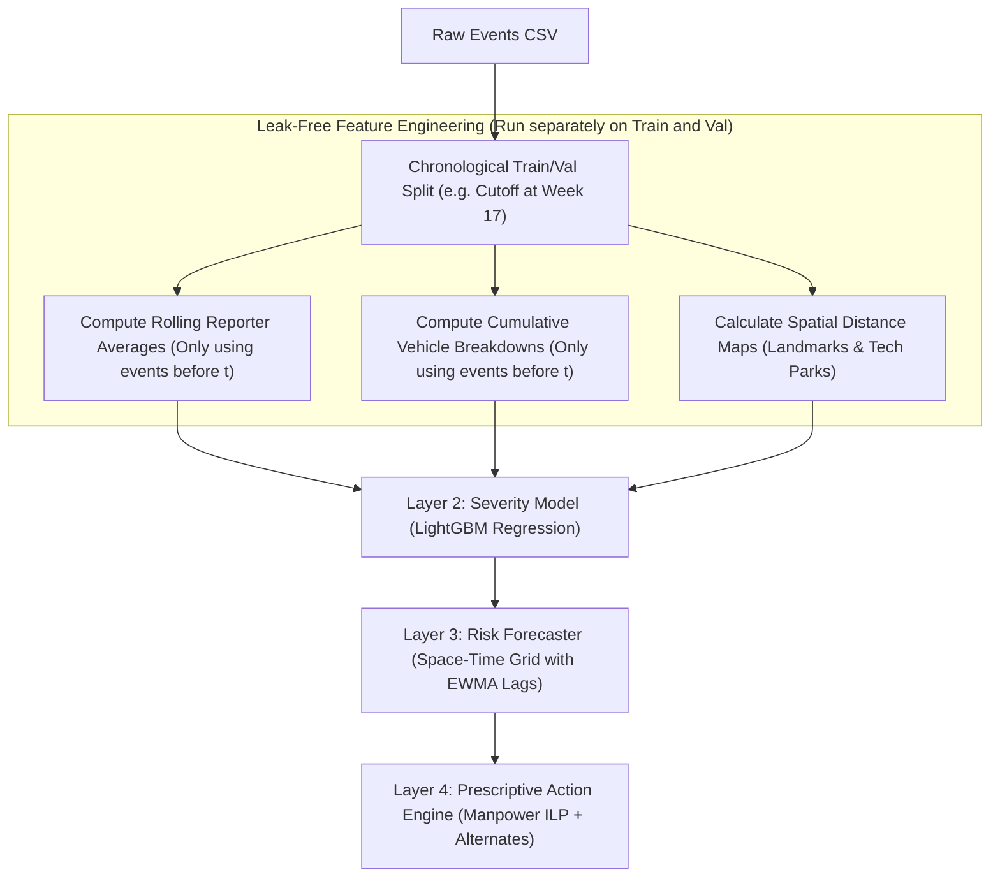

# Implementation Walkthrough: Event-Driven Congestion ML System (ECF-MS)

> **Goal:** Build a 4-layer ML system that starts with a strong primary data layer, then trains a severity model, then forecasts zone-time risk, and finally turns those predictions into deployment and routing decisions.

---

## Why 4 Layers

The main reason to split this into four layers is control. The primary layer makes feature extraction explicit, so the model layer only sees clean, observable signals. That reduces leakage, reduces overfitting, and gives you a wider picture of what the dataset actually knows before any prediction is made.

The structure is:

```text
Layer 1  Primary Layer   -> raw data, cleaning, enrichment, feature gates
Layer 2  Model Layer     -> event severity prediction
Layer 3  Risk Layer      -> zone x time risk forecasting
Layer 4  Action Layer    -> manpower allocation and route guidance
```

---

## Senior Principal ML Engineer Review (GOD MODE)

To ensure this system is production-ready for city-scale deployments (like Bengaluru), we must address critical target leakage hazards and spatial-temporal sparsity issues.

### 1. Leak-Free Architecture & Feature Engineering
When engineering historical entity features (e.g., reporter reliability, vehicle breakdown frequency, and hotspot event counts), standard global aggregations introduce severe **target leakage** (using future data to predict the past). 

To prevent this, our pipeline enforces a strictly chronological data split and computes rolling/cumulative features:



### 2. Core Operational Enhancements
*   **Leak-Free Entity Tracking**:
    *   **Rolling Reporter Average**: Calculate the average duration of a reporter's (`created_by_id`) history strictly using events that occurred *prior* to the current event's onset $t$.
    *   **Cumulative Vehicle Freq**: Count chronic breakdowns of a vehicle (`veh_no`) dynamically over time.
*   **Sparsity & Spatial Modeling in Layer 3**:
    *   **H3 Spatial Indexing**: Instead of modeling corridors as isolated islands, snap event coordinates to H3 hexagonal rings to aggregate risk from neighboring spatial regions.
    *   **Exponentially Weighted Moving Averages (EWMA)**: Replace simple 1-week/2-week lags with EWMA scores to smooth temporal risk predictions across high-sparsity periods (where ~92% of the space-time grid buckets contain 0 events).

---

## Repository Map

```
Phase2/                                      ← workspace root
├── Astram event data_anonymized...csv       ← raw event log
├── enrich_events.py                         ← primary layer feature pipeline
├── events_polished.csv                      ← enriched dataset
├── events_polished_summary.txt              ← data summary
├── dataset_review_and_ml_strategy.md        ← feature and strategy review
├── model_building_walkthrough.md            ← this file
├── event_driven_congestion_proposal.md      ← system proposal
└── model/
    └── train_severity.py                    ← layer 2 model training
```

---

## Layer 1 — Primary Layer: Data Foundation and Feature Extraction

This layer converts raw events into model-ready signals. It should be the first thing you trust and the first thing you validate.

### What this layer does

- Parse timestamps and sort by event start time.
- Build temporal features such as `start_hour`, `start_dow`, `time_of_day`, `is_peak_hour`, and `is_weekend`.
- Build calendar signals such as `is_public_holiday`, `is_ipl_day`, and `days_to_next_holiday`.
- Build spatial signals such as `geohash6`, `nearest_landmark_km`, `is_near_tech_hub`, and `segment_length_km`.
- Build entity signals such as `reporter_avg_duration_shrunk`, `vehicle_breakdown_freq`, and `has_citizen_corroboration`.
- Build text flags from `description` so sparse fields become useful instead of being dropped.

### Feature Engineering & Derivation Reference
A few of the features in the polished dataset are not directly present in the raw event log. They are engineered as follows:

*   **`weather_visibility_factor` (0.3 - 1.0)**:
    Since raw event data lacks weather feeds, weather conditions (Sunny, Foggy, Rainy, etc.) are generated using a synthetic Bengaluru monthly/hourly climate model. The visibility factor is mapped directly: Sunny (1.0), Partly Cloudy (0.9), Rainy (0.7), Foggy (0.5), Heavy Rain (0.4), and Thunderstorm (0.3).
*   **`lane_block_factor` (0.5 - 3.0)**:
    Derived by cleaning and mapping the `veh_type_clean` column. Missing vehicle types (which are ~40% null in the raw log) are imputed by scanning descriptions for keywords (e.g., BMTC, bus, truck, auto, car). Capacity reduction weights are then mapped: Heavy Vehicles/Trucks (3.0), Buses (2.5), LCVs (1.5), Cars (1.0), and Autos (0.5).
*   **`is_ipl_day` (0 or 1)**:
    Constructed by checking if the event date matches a hardcoded schedule of local IPL matches at Chinnaswamy Stadium.
*   **`reporter_avg_duration_shrunk` (float)**:
    Estimates reporter reliability from `created_by_id`. Calculated using additive smoothing (Empirical Bayes shrinkage) to pull sparse, low-volume reporters towards the global mean:
    $$\text{shrunk\_avg} = \frac{(\text{count} \times \text{avg}) + (10 \times \text{global\_avg})}{\text{count} + 10}$$
*   **`nearest_landmark_km` (float)**:
    Calculated using the Haversine formula from the event's `latitude`/`longitude` to the coordinates of 14 key points of interest in Bengaluru (e.g., stadiums, major junctions, commercial zones).
*   **`is_near_tech_hub` (0 or 1)**:
    Flagged as `1` if the `nearest_landmark_type` is classified as `tech_park` (e.g., Electronic City, Whitefield, Manyata, ITPL).

### Main Rule
Only keep features that would have been known at prediction time. If a field depends on the future, it does not belong in the primary layer feature set.

### Primary-layer checks
- No leakage columns such as final closure time inside the training features.
- Stable null handling across all folds.
- Time ordering preserved before any split.
- Feature definitions documented before model training starts.

### Output

`events_polished.csv` becomes the canonical training table for all later layers.

---

## Layer 2 — Model Layer: Event Severity Prediction

This layer predicts how long an event will last and how severe it is likely to become at creation time.

### File

`model/train_severity.py`

### Training scope

Use only rows where the event is closed or resolved and duration is known.

```python
train_mask = (
    (df['authenticated'] == 'yes') &
    (df['status'].isin(['closed', 'resolved'])) &
    (df['duration_minutes'].notna()) &
    (df['duration_minutes'] > 1) &
    (df['duration_minutes'] < 1440)
)
```

### Model design

- Regression target: `duration_minutes`
- Classification target: `impact_class`
- Model family: LightGBM
- Validation: `TimeSeriesSplit(n_splits=5)`

### Why this avoids overfitting

- The split is time-based, not random.
- Training rows are sorted by `start_datetime`.
- The feature list is fixed before fitting.
- Out-of-fold predictions are saved for later analysis.

### Expected targets

- MAE below 20 minutes for duration regression.
- Weighted F1 above 0.75 for impact classification.
- Critical-class recall above 0.80.

### Run

```bash
python model/train_severity.py
```

---

## Layer 3 — Risk Layer: Zone x Time Forecasting

This layer turns individual event predictions into operational risk by corridor, zone, day-of-week, and time block.

### Goal

Predict whether a given `(zone, corridor, start_dow, hour_block)` bucket is likely to see a High or Critical event.

### Feature construction

```python
df['hour_block'] = (df['start_hour'] // 4) * 4

agg = df.groupby(['zone', 'corridor', 'start_dow', 'hour_block', 'start_week']).agg(
    event_count=('id', 'count'),
    high_impact_count=('impact_class', lambda x: x.isin(['High', 'Critical']).sum()),
    avg_impact_score=('impact_score', 'mean'),
).reset_index()

agg['lag1_event_count'] = agg.groupby(['zone', 'corridor', 'hour_block'])['event_count'].shift(1)
agg['lag1_high_impact_count'] = agg.groupby(['zone', 'corridor', 'hour_block'])['high_impact_count'].shift(1)
agg['target_high_impact'] = (agg['high_impact_count'] >= 1).astype(int)
```

### Model design

- LightGBM classifier with balanced class weights.
- Probability calibration so risk scores are interpretable.
- Rolling lag features so the model learns recurrence without memorizing future data.

### What this layer gives you

- A risk surface instead of isolated predictions.
- A way to compare corridors fairly.
- A cleaner input for deployment planning.

### Overfitting guardrails

- Only past windows can form lag features.
- The aggregation window must be fixed and reproducible.
- Evaluate on later time slices only.

---

## Layer 4 — Action Layer: Manpower and Route Decisions

This layer turns risk into action. It should be prescriptive, not just descriptive.

### Manpower allocation

Use an integer or binary optimization step to assign officers where risk is highest and effectiveness is strongest.

```python
from pulp import LpMaximize, LpProblem, LpVariable, lpSum, value, PULP_CBC_CMD

def allocate_manpower(zone_risk_scores, officer_effectiveness, n_available):
    prob = LpProblem('manpower_allocation', LpMaximize)
    junctions = list(zone_risk_scores.keys())
    x = {j: LpVariable(f'x_{j}', cat='Binary') for j in junctions}

    prob += lpSum(
        zone_risk_scores[j] * officer_effectiveness.get(j, 1.0) * x[j]
        for j in junctions
    )
    prob += lpSum(x[j] for j in junctions) <= n_available
    prob.solve(PULP_CBC_CMD(msg=0))
    return {j: int(value(x[j])) for j in junctions}
```

### Route guidance

Map high-risk corridors to alternatives and timing advice.

```python
CORRIDOR_ALTERNATIVES = {
    'ORR East 1': ['Whitefield Road', 'Old Madras Road', 'Varthur Road'],
    'Tumkur Road': ['Chord Road', 'Magadi Road'],
    'Hosur Road': ['Bannerghatta Road', 'Koramangala Inner Ring Road'],
    'Bellary Road 1': ['HBR Layout Road', 'Nagawara Road'],
    'Mysore Road': ['Kanakapura Road', 'Magadi Road'],
}
```

### Output

- officer deployment suggestions
- route diversion suggestions
- best-time-to-travel windows
- human-readable action labels such as `MONITOR`, `OFFICER_DEPLOY`, or `FULL_DIVERSION`

---

## Validation Strategy

Use validation at every layer, not only at the end.

| Layer | What to check | Target |
|---|---|---|
| Primary layer | leakage, null stability, time ordering | pass |
| Model layer | MAE, weighted F1, critical recall | hit targets |
| Risk layer | AUC-ROC, Brier score, calibration | stable and calibrated |
| Action layer | sensible allocations and route choices | operationally consistent |

### Practical rules

- Never use random splits for temporal modeling.
- Save out-of-fold predictions for later stacking and audit.
- Inspect top feature drivers before shipping.
- Prefer calibrated probabilities over raw logits for operational decisions.

---

## SHAP and Interpretability

Use SHAP to verify that the model is learning the right signals.

```python
import shap

explainer = shap.TreeExplainer(lgb_reg)
shap_values = explainer.shap_values(X.iloc[:500])
shap.summary_plot(shap_values, X.iloc[:500], feature_names=FEATURES)
```

Expected top drivers:

- `weather_visibility_factor`
- `lane_block_factor`
- `is_peak_hour`
- `hotspot_event_count`
- `is_ipl_day`
- `reporter_avg_duration_shrunk`
- `requires_road_closure`

---

## Followable Build Order

1. Build `events_polished.csv` from the raw event log.
2. Freeze the primary-layer feature list and remove leakage.
3. Train the severity model with time-based cross-validation.
4. Aggregate events into zone-time buckets and train the risk model.
5. Add the optimization layer for officers and diversions.
6. Validate with OOF metrics, calibration, and SHAP.

---

## What Makes This Stronger

| Standard submission | 4-layer ECF-MS |
|---|---|
| One model only | Primary layer + severity + risk + action |
| Random validation | Time-based validation |
| Drop sparse fields | Mine entity, text, and spatial signals |
| Static answer | Dynamic recommendation pipeline |
| Prediction only | Prediction plus deployment decision |

The point of the 4-layer design is not to add complexity for its own sake. It is to separate feature extraction from prediction, prediction from aggregation, and aggregation from action so each step can be checked, tuned, and trusted.

> **The system is an Event Operations Copilot** — tells controllers WHO to deploy, WHERE, and WHEN, before congestion happens.
