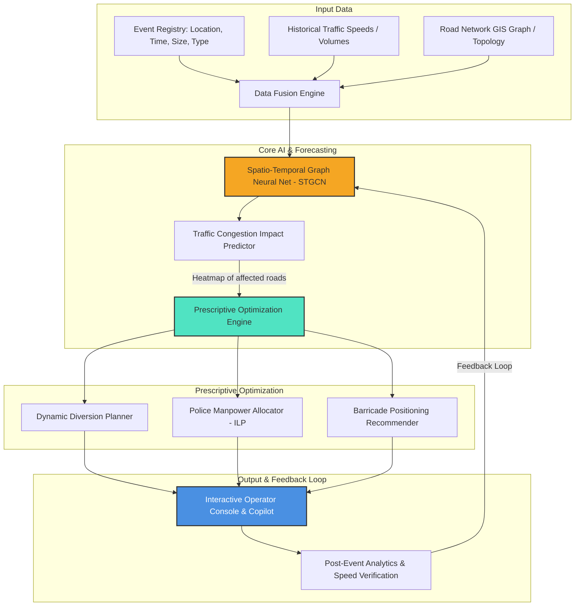

# Hackathon Theme Selection Analysis: Gridlock Hackathon 2.0 (Round 2)

This document provides a strategic analysis of the three problem statements proposed for the hackathon. The analysis is evaluated against three core criteria:
1. **Uniqueness (Low Selection Rate)**: Which theme will be chosen by fewer teams, giving a competitive edge?
2. **Technical Toughness (Complexity)**: Which theme has the highest intellectual and technical depth?
3. **Real-world Impact**: Which theme delivers the most valuable, proactive, and actionable results for city traffic authorities?

---

## Summary Comparison Matrix

| Theme | Uniqueness (1-5) | Technical Toughness (1-5) | Real-world Impact (1-5) | Overall Score |
| :--- | :---: | :---: | :---: | :---: |
| **Theme 1: Parking-Induced Congestion** | 4 / 5 | 4 / 5 | 4.5 / 5 | **12.5 / 15** |
| **Theme 2: Event-Driven Congestion** | 5 / 5 | 5 / 5 | 5 / 5 | **15 / 15** |
| **Theme 3: Computer Vision Violations** | 1 / 5 | 2 / 5 | 3 / 5 | **6 / 15** |

---

## Detailed Theme Breakdown

### Theme 1: Poor Visibility on Parking-Induced Congestion
**The Goal:** Build an AI system to detect illegal parking hotspots and *quantify* their exact impact on traffic flow to prioritize enforcement.

*   **Why it is tough:** Causal congestion modeling : you cannot just show correlation. You have to prove that *Vehicle A* parked at *Location X* directly caused a *Y% reduction in throughput*.
*   **Real-world Impact:** High. A single double-parked vehicle can choke an entire arterial road, turning a 3-lane street into a 1-lane bottleneck.

---

### Theme 2: Event-Driven Congestion (Planned & Unplanned)
**The Goal:** Forecast the spatial-temporal traffic impact of events (rallies, matches, road work, festivals) and recommend optimal manpower deployment, barricading, and diversion routes.

*   **Why people will choose it less (Highest Uniqueness):** This is the **least populated theme**. It requires designing custom optimization, graph, and prediction pipelines from scratch.
*   **Why it is tough (Highest Toughness):**
    *   Heterogeneous event representation (cricket match vs sudden protest)
    *   Spatio-Temporal Graph Neural Networks (GNNs)
    *   Prescriptive Optimization (diversions & resource allocation)
    *   Post-event closed-loop learning
*   **Real-world Impact (Highest):** Systemic. Major events cause gridlocks that paralyze entire quadrants of a city.

---

### Theme 3: Computer Vision Violations & OCR
**The Goal:** Process traffic camera streams to detect violations and extract license plates.

*   **Why people will choose it more (Lowest Uniqueness):** At least 60% of all submissions will choose this. Standard template: YOLOv8 + DeepSORT + Tesseract/EasyOCR.
*   **Why it is less tough:** Core algorithms are pre-trained and mature. Very little conceptual novelty.
*   **Real-world Impact:** Moderate and reactive : does not directly reduce gridlock.

---

## Recommendation: Event-Driven Congestion (Theme 2)

**Theme 2** is the clear winner:
1. **Stand Out from the Crowd** : Judges will see dozens of CV violation detectors. A predictive + prescriptive system for police staffing and diversion planning is rare.
2. **Highest scoring criteria fit** : Uniqueness, systemic impact, and algorithmic complexity all peak with Theme 2.
3. **Builds on existing codebase** : The workspace already has `train_model.py` and traffic demand notebooks, making spatio-temporal extension natural.

---

## Proposed Solution Blueprint for Theme 2

### Key Technical Pillars:
1. **The Predictor** : Spatio-Temporal GNN models the road system as a directed graph
2. **The Optimizer** : ILP for police allocation + constrained shortest-path for diversions
3. **Interactive Control Center** : Leaflet.js map with event epicenter, heatmap, and clickable diversion suggestions
